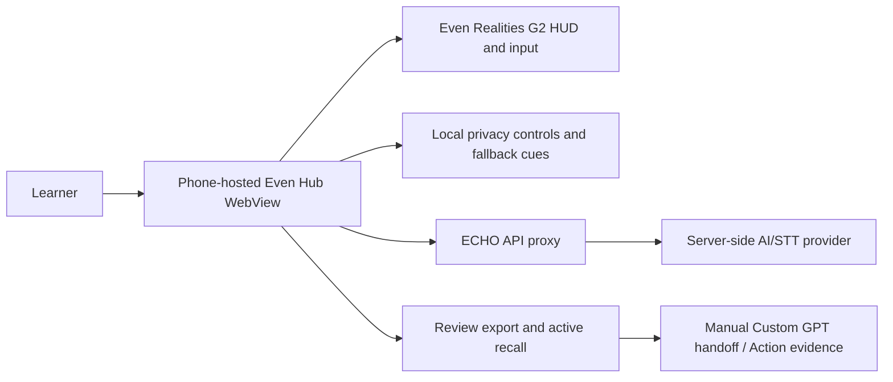

# Project ECHO Architecture Draft

Draft only. This is a portfolio architecture evidence starting point, not final
release evidence. Copy to a stable non-draft path only after the pilot and
hardware QA manifests are complete.

## App Version

- echo-app: 0.1.8
- Evidence status: draft

## Boundary Diagram

## Claims To Prove Before Portfolio Use

- The G2 HUD shows only READY, LISTENING, CUE, ACK, and PAUSED during live speech.
- G2 Mic and Phone Mic paths remain explicit; no silent phone microphone fallback.
- Raw transcripts/audio do not leave the client unless the user opted into cloud processing.
- Provider keys, session tokens, and direct provider hosts are absent from dist and .ehpk artifacts.
- The completed pilot manifest links this architecture artifact.
